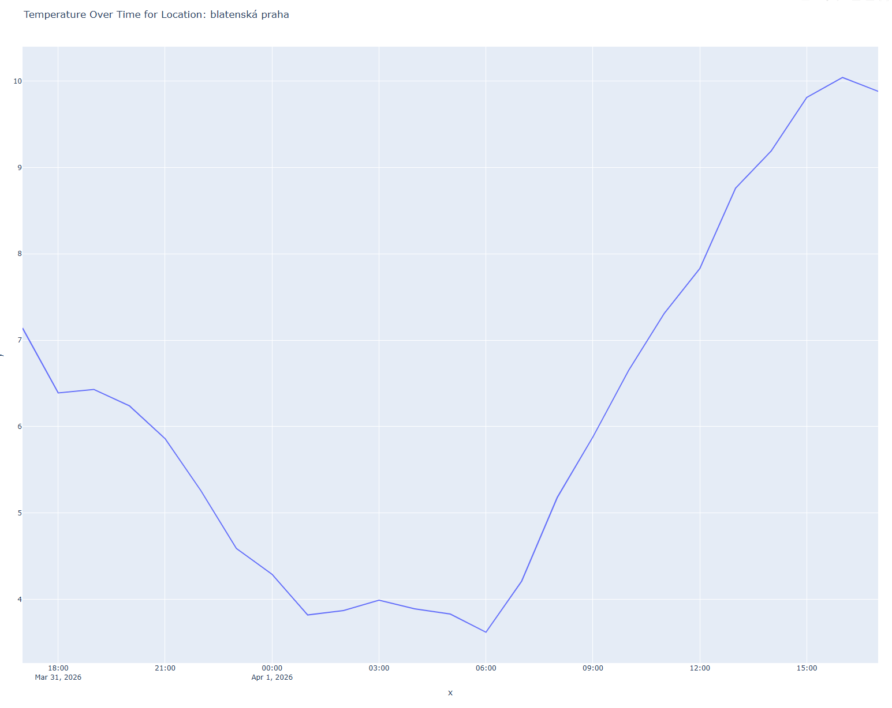

## Úkol 2: Načítanie z API, vizualizácia cez Plotly a výstup do CSV
### Requirements:
  pip install pandas  
  pip install plotly[express]  
  pip install requests  

### Spustiť program api-caller.py
Pripojí sa postupne na dve API:
API_RT = "https://api.tomorrow.io/v4/weather/realtime"
API_TL= "https://api.tomorrow.io/v4/timelines"

Prvá vráti aktuálne parametre lokácie.
Druhá po naparsovaní lat,long vypíše teploty za posledných 24 hodín.

Dáta zobrazí v prehliadači ako vývojovú krivku teploty a na mieste kde sa spustí skript, vytvorí súbor "teploty" s dátumom v názve. 

Samozrejme, skript sa dá ďalej vytuniť o nastavenie lokácie podľa aktuálnej IP adresy, prípadne nastavenie proxy, ak je užívateľ na firemnej sieti za FW (priamo v knižnici "requests" použitím parametru "proxies"). 
Taktiež by sa dalo volať skript s parametrami, napr. na definovanie startTime, units, timestamps, ...
Skript dovoľuje výpis len za posledných 24 hodín, čo je dané limitom free účtu na tomorrow.io. 

API key pre tento účel je priamo v skripte, ale tiež sa dá volať ako parameter, prípadne do enviroment. 




CSV:
```
timestamp,temperature
2026-03-31T17:00:00Z,7.14
2026-03-31T18:00:00Z,6.39
2026-03-31T19:00:00Z,6.43
2026-03-31T20:00:00Z,6.24
2026-03-31T21:00:00Z,5.86
2026-03-31T22:00:00Z,5.26
2026-03-31T23:00:00Z,4.59
2026-04-01T00:00:00Z,4.29
2026-04-01T01:00:00Z,3.82
2026-04-01T02:00:00Z,3.87
2026-04-01T03:00:00Z,3.99
2026-04-01T04:00:00Z,3.89
2026-04-01T05:00:00Z,3.83
2026-04-01T06:00:00Z,3.62
2026-04-01T07:00:00Z,4.21
2026-04-01T08:00:00Z,5.18
2026-04-01T09:00:00Z,5.88
2026-04-01T10:00:00Z,6.65
2026-04-01T11:00:00Z,7.31
2026-04-01T12:00:00Z,7.83
2026-04-01T13:00:00Z,8.76
2026-04-01T14:00:00Z,9.19
2026-04-01T15:00:00Z,9.81
2026-04-01T16:00:00Z,10.04
2026-04-01T17:00:00Z,9.88
```


## ukol1-vizualizace.py 
načíta vystup.txt a zobrazí graf s teplotami od 1.1. - 31.3. vo výška 300, 500, 800 a 1100 m.n.m. použitím Plotty Line grafu

Tak som ešte pridal i ten seaburn. 
Je tam scatter diagram a k tomu heatmap po mesiacoch.


