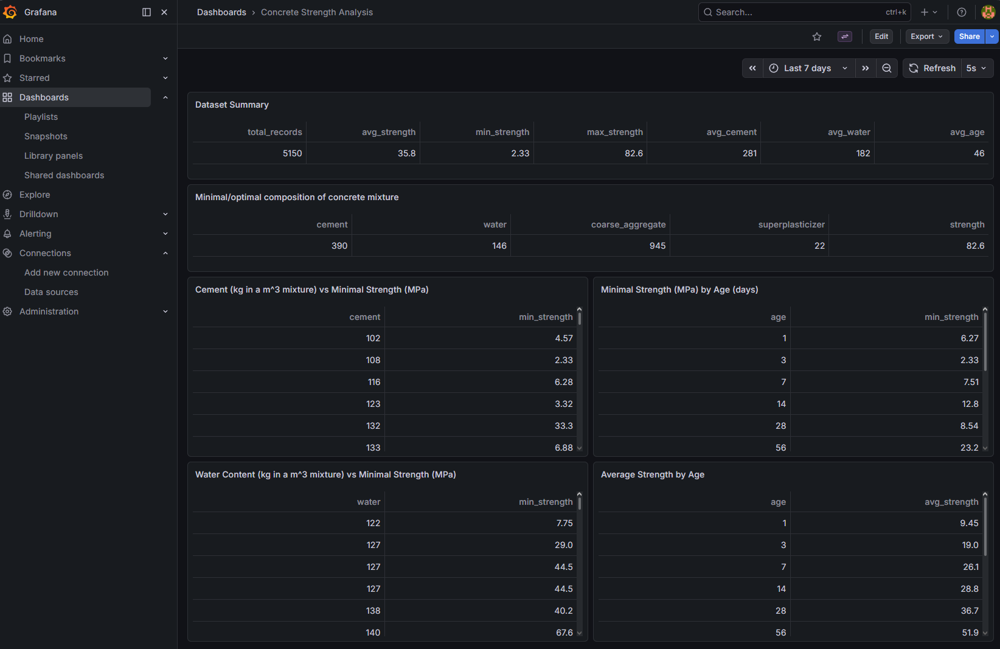
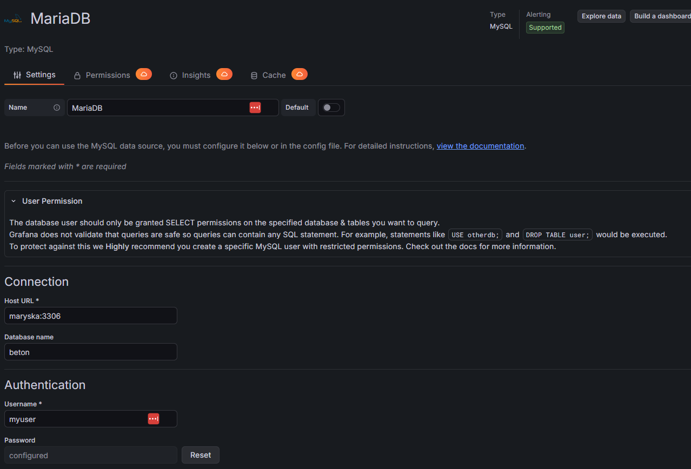

## Úkol 3: Vytvořte virtuální Docker síť pomocí docker network create.

Toto riešenie vytvorí skupinu služieb, závislých na bežiacej MariaDb:
- [x] **MariaDB** instance "maryska"
- [x] **Python** instance "concrete-loader"
- [ ] **Grafana** instance "grafana"

Po zkompilovaní image 
```
docker compose build
```
 v podzložke **ukol-db-docker**, naštartujeme službu 
```
docker compose up -d 
```
Vytvorí sa a soustí skupina containerov: **ukol-db-docker**
Táto skupina obsahuje vyššie zmienené kontajnery:
- **MariaDB** instance "maryska" počúvajúca na štandartnom porte 3306
- **Grafana** instance "grafana" počúvajúca na štandartnom porte 3000
- **Python** instance "concrete-loader" 

**maryska** má už pri builde zadefinovanú štrukturu tabuľky `concrete_data` a view `concrete_summary`. Kompilátor si berie štruktúru zo súboru `init.sql`.

**concrete-loader** hneď po  naštartovaní najprv kontroluje dostupnosť DB.
V logu kontajnera nás služba informuje o stave:
`DB not ready yet (2003 (HY000): Can't connect to MySQL server on 'maryska:3306' (111)), retrying in 3s...`
Akonáhle je DB dostupná, oznámi nám: `Database is available.`

V ten moment si načíta súbor `/app/Concrete_Data.csv` a nahrá ho do predpripravenej DB štruktúry. 
O úspešnosti operácie nás informuje v logu `Data loaded successfully into the database.`

**grafana** inštancia nám vizualizuje data z tabuliek naplnených **concrete-loader**-om.
Build je nastavený tak, aby si zo zložiek `provisioning` a `dashboards` vzal definície dátoveho pripojenia a vytvoril preddefinovaný dashboard,
Do Grafany sa prihlasujeme východzím administrátorským účtom ako admin/adminpw





